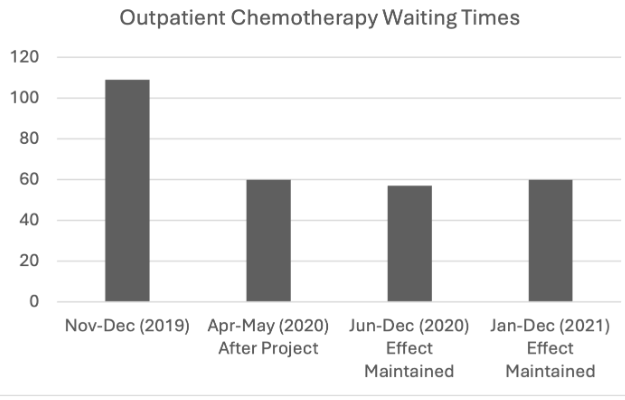
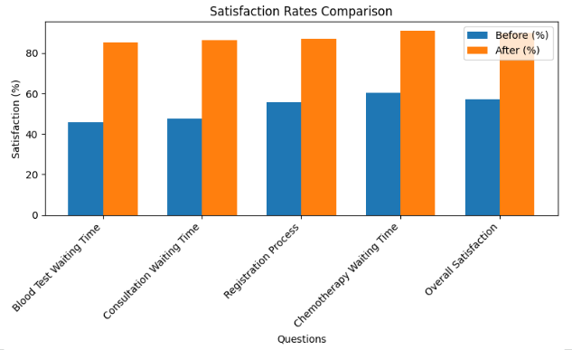
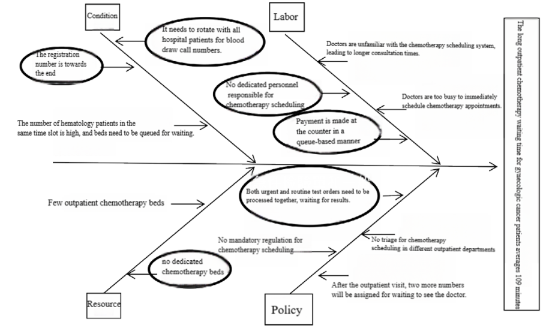
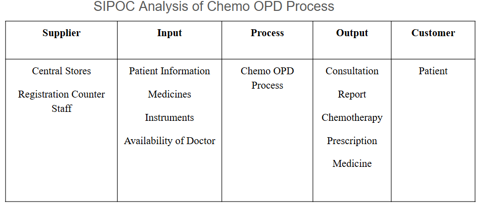
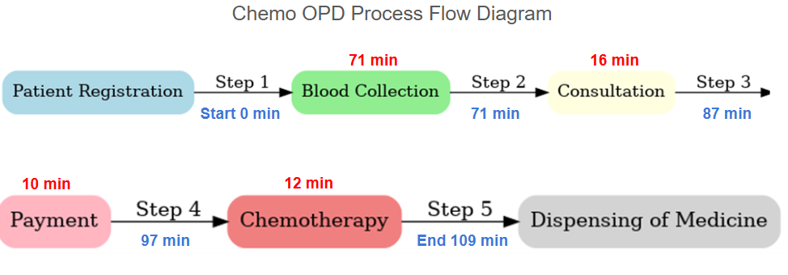

# Reducing Chemotherapy Waiting Times Using Lean Six Sigma
This project demonstrates the application of Lean Six Sigma (LSS) principles using the DMAIC framework to reduce outpatient chemotherapy waiting times and improve patient satisfaction, based on a case study from Cathay General Hospital.

## Problem
Outpatient chemotherapy patients, particularly those with gynecologic cancer, experienced excessive waiting times due to bottlenecks in scheduling, blood testing, bed allocation, and staff coordination. The average waiting time was 109 minutes, and patient satisfaction was only 57.3%.

**Objective**: Apply DMAIC to reduce the average waiting time below 60 minutes and increase patient satisfaction to at least 85%.

##  Methodology: DMAIC Framework
Sigma Level: ~2.0 (low process performance)
### Define
  CTQ (Critical to Quality): Total patient waiting time (token issued → medication received)
  Goal: Reduce average waiting time to under 60 minutes within 6 months
  Tools Used: SIPOC diagram, process mapping
### Measure
  Collected baseline data from 45 gynecologic cancer patients
  Identified longest delays in blood testing and consultation
  Calculated:
   - Average Waiting Time: 109 minutes
   - Defect Rate: 80% of patients waited >60 minutes
   - DPMO: 800,000
### Analyze
  Conducted Fishbone (Cause-and-Effect) analysis
  Key root causes identified:
  - Long blood test wait times
  - Scheduling misalignment
  - Limited chemo bed availability
  - Consultation queue delays
### Improve
  Implemented 7 major interventions:
  - Dedicated chemo appointment system
  - Blood collection priority counters
  - Priority scheduling protocols
  - Bed allocation optimization
  - Assigned case managers for patient flow
  - Standardized scheduling processes
  - Digital registration and check-in systems
  Results:
  - Waiting time reduced from 109 → 60 minutes (45% reduction)
  - Satisfaction increased from 57.3% → 90%
### Control
  Developed KPI dashboard to monitor:
  - Average waiting time (monthly)
  - Patient satisfaction (quarterly surveys)
  - Lab test turnaround time
  Established early warning alerts when KPIs exceed thresholds
  Quarterly staff training and process simulations
  Reward system for continuous improvement suggestions

## Outcome
| Metric                     | Before   | After    |
|---------------------------|----------|----------|
| Average Waiting Time      | 109 mins | 60 mins  |
| Overall Satisfaction      | 57.3%    | 90%      |
| Blood Test Satisfaction   | 45.8%    | 85.5%    |
| Consultation Satisfaction | 47.6%    | 86.5%    |

## Visuals
### Waiting Time Comparison Before & After

Significant reduction achieved through Lean Six Sigma interventions:

---

### Patient Satisfaction Improvement

Improvement across all key satisfaction metrics:

---

### Root Cause Analysis (Fishbone Diagram)

---

### 🗂SIPOC Diagram of Chemo OPD

---

### Process Flow (Before Improvement)

## Tools
Lean Six Sigma • DMAIC • Healthcare Analytics • KPI Design • Process Mapping • Fishbone Diagrams • Dashboard Visualization
